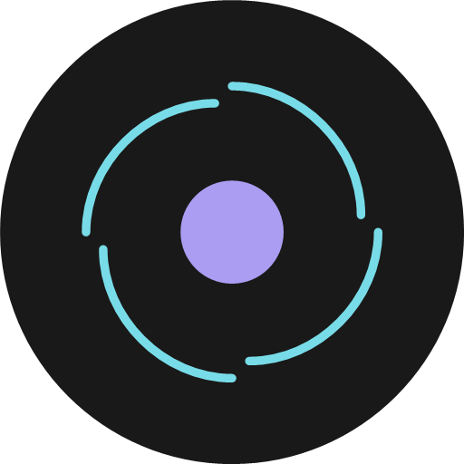

# Cygnus Player

[](https://github.com/FesterHead/cygnus-player/releases/latest)
[](https://github.com/FesterHead/cygnus-player/releases)
[](https://github.com/FesterHead/cygnus-player/actions)
[-78DCE8?style=flat-square&labelColor=221F22&logo=android&logoColor=white)](https://developer.android.com)
[](https://kotlinlang.org)
[](https://developer.android.com/jetpack/compose)
[](https://developer.android.com/media/media3)
[](LICENSE)

Cygnus Player is a minimalist, high-performance local audio player for Android, specifically engineered to handle massive, duplicate-heavy M3U/M3U8 playlists of **MP3 files** with sub-millisecond responsiveness.

Designed for collectors with large libraries, Cygnus Player prioritizes a low memory footprint ($O(1)$ relative to queue size) and absolute sequence integrity.

## ⚠️ Project Status & Disclaimer

Cygnus Player is a personal, open-source hobby project provided strictly **as-is** without official support or formal issue tracking. Feature scope is intentionally tight and focused on a minimalist MP3 playback engine. However, pull requests targeting `main` (or `develop`) that align with project goals and technical standards may be accepted. Please review [CONTRIBUTING.md](CONTRIBUTING.md) before submitting code changes. You are also welcome to fork the repository and adapt the code to suit your own needs under the terms of the MIT License.

## 🌌 Why "Cygnus Player"?

The name is a direct tribute to the legendary progressive rock band **Rush** and their epic multi-album masterpiece, _Cygnus X-1_.

Specifically, it honors what is "the ultimate transition" in rock history: the frantic, heavy sci-fi cliffhanger ending of "Cygnus X-1 Book I: The Voyage" (the finale of _A Farewell to Kings_) bridging seamlessly into the triumphant, complex multi-movement opening of "Book II: Hemispheres" (on the subsequent _Hemispheres_ album).

Modern commercial streaming apps and feature-bloated players treat music like a data-harvesting commodity. To borrow a line from Rush in _Superconductor_: **"That's entertainment!"** But it isn't an optimal listening experience for a serious archive. Traditional metadata-tag or basic folder-shuffling players completely destroy complex narrative arcs—randomly inserting a compressed compilation track or a raw bootleg right in the middle of a gapless, multi-album experience.

**Cygnus Player** is engineered to anchor precise M3U sequences down to the millisecond, preserving historical sonic continuity while still providing the mathematical flexibility to drop the entire library into total chaos mode when desired.

## 🚀 Key Features

- **Sequence-Critical Playback**: Unlike traditional players, Cygnus treats every entry in an M3U playlist as a unique node. Duplicate tracks in a sequence retain independent selection probabilities and metadata context.
- **Massive Scale Support**: Optimized Room database schema and primitive-array shuffle mappings handle 45,000+ item queues and 78,000+ track libraries with zero lag.
- **Advanced Shuffle Modes**:
  - `SEQUENTIAL`: Standard linear playback.
  - `TRACK_RANDOM`: True shuffle across the entire sequence.
  - `RANDOM_FOLDER_SEQUENTIAL`: Shuffles directory groups, playing all tracks within a folder sequentially before moving to the next random folder (with a 24-folder history buffer).
- **Minted Identity**: Playlists are assigned a shuffle strategy at the moment of creation, ensuring deterministic behavior for specialized collections (e.g., a dedicated "Chaos" vs. "Album" playlist).
- **No-Skip Philosophy**: Designed for the "full experience" listener—no forward/back controls. Playback is an immutable journey once started.
- **Dynamic ReplayGain**: "Smart" real-time volume normalization. Automatically applies `ALBUM_GAIN` for sequential flows and `TRACK_GAIN` for randomized tracks.
- **Persistent State Across Updates**: Per-playlist state (last played `sequence_id`, exact track position, active `ShuffleMode`, and exact shuffled order mapping) is stored in the Room database, ensuring all playback positions and custom shuffle orders are retained across application restarts and updates.
- **Modern Android Core**: Built for Android 16 (API 36) using Jetpack Compose, Media3 (ExoPlayer), and Jetpack Glance.

## 📱 Application Screenshots

### Initial Setup & Storage Access

|                                         App Launch                                          |                                            Select Music Root                                            |                                           SAF Root Permission                                            |                                         Media Permission                                         |
| :-----------------------------------------------------------------------------------------: | :-----------------------------------------------------------------------------------------------------: | :------------------------------------------------------------------------------------------------------: | :----------------------------------------------------------------------------------------------: |
|  |  |  |  |

### Playlist Management & Minting

|                                          Empty Playlist History                                           |                                             Mint Shuffle Mode                                             |                                            Active Playlist History                                             |
| :-------------------------------------------------------------------------------------------------------: | :-------------------------------------------------------------------------------------------------------: | :------------------------------------------------------------------------------------------------------------: |
|  |  |  |

### Playback, Widget & Configuration

|                                 Minimalist Now Playing                                  |                                Home Screen Widget                                |                                  Settings & Diagnostics                                   |
| :-------------------------------------------------------------------------------------: | :------------------------------------------------------------------------------: | :---------------------------------------------------------------------------------------: |
|  |  |  |

## 📁 Storage & Scoped Storage Compliance

Cygnus Player is fully compatible with modern Android **Scoped Storage** requirements. To ensure high-performance relative path resolution for massive libraries, please follow these steps:

1. **Select Music Root**: On first launch, use the prompt to select your main music directory (e.g., `Internal Storage > Music`). This grants Cygnus persistent, recursive access to your entire library.
2. **Relative Path Resolution**: The app uses the **MediaStore API** to map M3U relative paths (e.g., `Rush/2112/01 - 2112.mp3`) to system-registered content URIs. This avoids restricted direct filesystem access and ensures absolute sequence integrity.
3. **Permissions**: Ensure the `READ_MEDIA_AUDIO` permission is granted to allow the system to index your music files for the MediaStore.

## 🤖 AI-Assisted Development

This project is developed and managed using Google AI models. The architecture, implementation, and repository maintenance are guided by specialized AI agents to ensure high-performance, minimalist engineering standards.

## 🛠 Tech Stack

- **Target Platform**: Android 16 (API Level 36)
- **UI Framework**: Jetpack Compose
- **Playback Engine**: `androidx.media3:media3-exoplayer` & `MediaSessionService`
- **Database**: `androidx.room` with SQLite indexing on `sequence_id` and `file_path`
- **Widgets**: `androidx.glance`
- **Language**: Kotlin with Coroutines and Flow

## 🏗 Architecture Highlights

### 1. Unique Sequence Mapping

Traditional media queues struggle with duplicate file paths. Cygnus Player maps every playlist entry to a unique `sequence_id`. This allows the engine to distinguish between multiple occurrences of the same file, preserving the exact intent of the M3U creator.

### 2. Persistent Pointer Arrays

To ensure "Resuming" never triggers a new shuffle, Cygnus stores the generated playback sequence (`LongArray`) in the database. When you switch between your specialized playlists, you return to the exact track and sequence state you left.

### 3. O(1) Memory Footprint

To support enormous playlists, the `ShuffleEngine` operates on primitive `LongArray` mappings. Heavy domain models and metadata are never loaded for the entire queue at once. Instead, Cygnus utilizes a sliding cursor window of a few tracks at a time to lazily populate UI and media session context.

### 3. Folder-Aware Engine

The database tracks folder relationships via a dedicated `FolderEntity`. This enables native support for folder-based automation and randomized folder sequencing without expensive file system traversals during playback.

## 🎨 Branding & Iconography

### The "Singularity" Icon

<p align="center">
  
</p>

Cygnus Player utilizes a custom-designed **Adaptive Icon** that reflects the cosmic and musical themes of the project:

- **Design Principle**: A minimalist geometric representation of **Cygnus X-1**, the first black hole discovered in our galaxy.
- **Visual Elements**:
  - **The Singularity**: A central circle (Monokai Purple) representing the core of the music and the point of no return for the listener's focus.
  - **The Event Horizon**: Four symmetrical circular arcs (Monokai Blue/Cyan) implying rotation, gravitational pull, and the dynamic energy of the audio sequence.
- **Rationale**: The design uses common geometric property to ensure absolute **Copyright Safety**. It avoids literal depictions or franchise-specific imagery while maintaining a high-performance, scientific aesthetic.
- **Accessibility**: Optimized for the **Monokai Pro (Filter Spectrum)** palette, ensuring high visibility for red-green color-blind users.

## 📈 Status & Roadmap

- [x] **Core Database**: Entities for massive library management.
  - [x] `TrackEntity`: Metadata and ReplayGain storage (with non-nullable defaults).
  - [x] `FolderEntity`: Directory-aware grouping.
  - [x] `QueueEntity`: Unique sequence mapping (duplicates support).
  - [x] `PlaylistState`: Per-M3U persistence with strongly-typed `ShuffleMode`.
- [x] **Data Logic**: High-performance M3U parser and file picker integration.
  - [x] M3U/M3U8 Parser: Efficient line-by-line relative path resolution.
  - [x] Metadata Extractor: Background extraction of ReplayGain and media tags (with `"<not found>"` fallback).
  - [x] File Picker: System integration for playlist selection.
  - [x] Playlist History: Manageable UI for recently opened M3Us (supports removal).
- [x] **Core Logic**: High-performance sequence and shuffle management.
  - [x] `ShuffleEngine`: $O(1)$ memory-efficient primitive array mappings with **Forward-Only** logic.
  - [x] Folder-Sequential Logic: History-aware directory shuffling (24-folder buffer).
  - [x] ReplayGain Controller: "Smart" gain switching logic (Album vs. Track).
- [x] **Playback**: Media3 Service integration with ReplayGain and Audio Focus.
  - [x] `MediaSessionService`: Foreground service with Android 16 security bounds.
  - [x] ExoPlayer Core: Gapless transition and volume normalization.
  - [x] Lazy Queue Controller: Sliding window logic for $O(1)$ memory playback.
  - [x] System Integration: Audio Focus and `BECOMING_NOISY` handling.
  - [x] Playback Control Integration: Hooking UI Play/Pause actions to the service.
  - [x] Scoped Storage Compliance: Folder-based access and MediaStore URI resolution.
- [x] **UI Baseline**: Minimalist playback screen (Index/Total display) and Home Screen Widget. No navigation controls.
  - [x] Theme: Monokai Pro palette with high-contrast accessibility (Red-Green).
  - [x] App Icon: "Singularity" adaptive icon (Cygnus X-1 theme).
  - [x] Main Screen: Branding updated to "Cygnus Player" and Marquee text implemented.
  - [x] Glance Widget: Minimalist 4x1 high-contrast remote views with dynamic artwork.
- [x] **Advanced Features**: Relative path sanitization improvements, Scrobbler integration testing, and **Minimalist Android Auto support** (via `MediaLibraryService` for safe, voice-controlled library access).
  - [x] Android Auto & AAOS Support: Minimalist browsing and dashboard control.
  - [x] Position Persistence: Per-playlist millisecond-accurate resumption.
  - [x] Smart Bluetooth: Automated playback resumption upon device reconnection.

### 🚗 Android Auto Setup & Local Testing

Because Cygnus Player is distributed via GitHub Releases (or custom builds) rather than the Google Play Store, Android Auto's security policy hides sideloaded media apps by default. Follow these steps to enable Cygnus Player on Android Auto and test it locally on your PC.

#### 1. Enable Android Auto Developer Mode & Unknown Sources (Phone Setup)

1. Open **Settings** on your phone and search for **Android Auto**.
2. Scroll to the bottom and tap **Version** **10 times** to enable **Developer Mode**.
3. Tap the top-right menu (**⋮**) -> **Developer settings**.
4. Check **"Unknown sources"**.
5. Reconnect your phone to your vehicle (or restart Android Auto).

#### 2. Local Head Unit Testing via Desktop Head Unit (DHU)

To test the Android Auto interface directly on your computer without going out to a car:

1. Enable **Developer Mode** on your phone (step 1 above).
2. Tap **⋮** in Android Auto settings on phone -> **Start head unit server**.
3. Use the **`cauto`** alias to install the app and forward ports, or run manually:

   ```powershell
   adb forward tcp:5277 tcp:5277
   ```

4. Launch the Desktop Head Unit (DHU) emulator from your PC terminal:

   ```powershell
   & "$env:LOCALAPPDATA\Android\Sdk\extras\google\auto\desktop-head-unit.exe"
   ```

## 🧪 High-Efficiency Workflows

To maintain "Zero-Manual-Discovery" of bugs while bypassing framework-level environmental issues and supporting multi-device environments (Phone vs. Emulator), use the following PowerShell aliases.

### 1. Alias Setup

To obtain your target device serial numbers, run `adb devices` in your terminal:

```powershell
adb devices
# Output example:
# List of devices attached
# 44201JEKB09382    device
# emulator-5554     device
```

Replace `"44201JEKB09382"` with your physical device's serial number, or pass `"emu"` to target the local emulator (`emulator-5554`).

Add these helper functions to your PowerShell `$PROFILE`:

```powershell
# Cygnus Player Development Aliases (v1.5 - Sanitized & Multi-device)
# Usage: crun (defaults to phone) or crun emu

function ctest {
    param([string]$target = "44201JEKB09382")
    if ($target -eq "emu") { $target = "emulator-5554" }

    $oldGradle = $env:GRADLE_HOME; $oldJava = $env:JAVA_HOME
    $env:GRADLE_HOME = $null; $env:JAVA_HOME = $null

    adb -s $target shell input keyevent 224
    adb -s $target shell wm dismiss-keyguard
    adb -s $target uninstall com.festerhead.cygnusplayer
    try {
        $env:ANDROID_SERIAL = $target
        ./gradlew test connectedDebugAndroidTest --no-configuration-cache
    } finally {
        $env:ANDROID_SERIAL = $null
    }

    $env:GRADLE_HOME = $oldGradle; $env:JAVA_HOME = $oldJava
}

function crun {
    param([string]$target = "44201JEKB09382")
    if ($target -eq "emu") { $target = "emulator-5554" }

    $oldGradle = $env:GRADLE_HOME; $oldJava = $env:JAVA_HOME
    $env:GRADLE_HOME = $null; $env:JAVA_HOME = $null

    adb -s $target shell input keyevent 224
    adb -s $target shell wm dismiss-keyguard
    adb -s $target uninstall com.festerhead.cygnusplayer
    try {
        $env:ANDROID_SERIAL = $target
        ./gradlew installRelease --no-configuration-cache
    } finally {
        $env:ANDROID_SERIAL = $null
    }
    adb -s $target shell am start -n com.festerhead.cygnusplayer/.MainActivity

    $env:GRADLE_HOME = $oldGradle; $env:JAVA_HOME = $oldJava
}

function cdebug {
    param([string]$target = "44201JEKB09382")
    if ($target -eq "emu") { $target = "emulator-5554" }

    $oldGradle = $env:GRADLE_HOME; $oldJava = $env:JAVA_HOME
    $env:GRADLE_HOME = $null; $env:JAVA_HOME = $null

    adb -s $target shell input keyevent 224
    adb -s $target shell wm dismiss-keyguard
    adb -s $target uninstall com.festerhead.cygnusplayer
    try {
        $env:ANDROID_SERIAL = $target
        ./gradlew installDebug --no-configuration-cache
    } finally {
        $env:ANDROID_SERIAL = $null
    }
    adb -s $target shell am start -n com.festerhead.cygnusplayer/.MainActivity

    $env:GRADLE_HOME = $oldGradle; $env:JAVA_HOME = $oldJava
}

function cauto {
    param([string]$target = "44201JEKB09382")
    if ($target -eq "emu") { $target = "emulator-5554" }

    # 1. Kill existing DHU on PC
    taskkill /IM desktop-head-unit.exe /F /T 2>$null

    # 2. Sanitize environment
    $oldGradle = $env:GRADLE_HOME; $oldJava = $env:JAVA_HOME
    $env:GRADLE_HOME = $null; $env:JAVA_HOME = $null

    # 3. Prepare phone
    adb -s $target shell input keyevent 224
    adb -s $target shell wm dismiss-keyguard
    adb -s $target uninstall com.festerhead.cygnusplayer
    adb -s $target forward tcp:5277 tcp:5277

    # 4. Build and Install
    try {
        $env:ANDROID_SERIAL = $target
        ./gradlew installDebug --no-configuration-cache
    } finally {
        $env:ANDROID_SERIAL = $null
    }

    # 5. Restore environment
    $env:GRADLE_HOME = $oldGradle; $env:JAVA_HOME = $oldJava

    # 6. Launch DHU as an independent process
    Write-Host "App installed. Launching DHU..." -ForegroundColor Cyan
    $dhuPath = "$env:LOCALAPPDATA\Android\Sdk\extras\google\auto\desktop-head-unit.exe"
    Start-Process -FilePath $dhuPath
}

function csync {
    git fetch origin
    git checkout main; git pull origin main
    git checkout develop; git merge main
    git push origin develop
}
```

> [!NOTE]
> The `$env:ANDROID_SERIAL` environment variable ensures Gradle tasks (like `connectedDebugAndroidTest` or `installDebug`) target only the specified serial when multiple Android devices are connected. The aliases also sanitize the local environment by unsetting `GRADLE_HOME` and `JAVA_HOME` to prevent toolchain conflicts.

### 2. Manual Commands

If you prefer the standard Gradle tasks, ensure the emulator is **awake and unlocked** first:

```powershell
# Wake up and unlock
adb shell input keyevent 224; adb shell wm dismiss-keyguard

# Run full suite
./gradlew test connectedDebugAndroidTest
```

## 🚀 Deployment & CI/CD

### Local Deployment

The fastest way to deploy is using the **`crun`** or **`cdebug`** aliases defined above. Alternatively, use the manual commands:

```powershell
./gradlew :app:assembleDebug
adb install -r app/build/outputs/apk/debug/app-debug.apk
adb shell am start -n com.festerhead.cygnusplayer/.MainActivity
```

> [!NOTE]
> If `adb` is not recognized, you may need to use the full path to the executable (e.g., `C:\Users\<User>\AppData\Local\Android\Sdk\platform-tools\adb.exe`) or add the `platform-tools` directory to your system's `PATH`.

### GitHub Actions (CI/CD)

Cygnus Player utilizes GitHub Actions for continuous integration and delivery:

- **Debug Builds (`develop`):** You can manually trigger a Debug build from the Actions tab using `workflow_dispatch` on the `develop` branch (or any other branch). The resulting APK is available to download as a temporary Artifact.
- **Release Verification (PRs to `main`):** Opening a Pull Request against the `main` branch automatically triggers the `Android Release Build` workflow. It securely signs and builds a Production-ready APK, attached as a temporary Artifact for verification. You can also manually trigger this workflow via `workflow_dispatch` on the `develop` branch for pre-release testing.
- **Automated GitHub Releases (Pushes to `main`):** When a Pull Request is merged into `main`, the workflow automatically creates a public GitHub Release and attaches the signed Production APK to it. The release tag (e.g., `v1.0.0`) is automatically determined by reading the `version.properties` file.

#### Versioning

The app's version is maintained in two locations for build stability:

1. **`version.properties`**: The primary source of truth used by Gradle and CI/CD.
2. **`VersionInfo.kt`**: A static object in the source code used by the UI to avoid `BuildConfig` race conditions in experimental environments.

Before merging to `main` to trigger a release, ensure both files are updated:

```properties
# version.properties
VERSION_NAME=1.0.7
VERSION_CODE=8
```

```kotlin
// VersionInfo.kt
object VersionInfo {
    const val VERSION_NAME = "1.0.7"
    const val VERSION_CODE = 8
}
```

Gradle will automatically inject these values into the APK, and the GitHub Action will parse them to name your automated Release!

#### Repository Secrets Configuration

To enable automated signed releases, the GitHub repository must be configured with the following **Repository Secrets** (`Settings > Secrets and variables > Actions`):

- `KEY_ALIAS`: The alias for the signing key.
- `KEY_PASSWORD`: The strong UUID password for the key.
- `KEYSTORE_PASSWORD`: The strong UUID password for the keystore.
- `KEYSTORE_BASE64`: The full base64-encoded string of the `cygnus-release.keystore` binary file.

---

## 📜 Credits & Licensing

- **"Impact Moderato"** by Kevin MacLeod ([incompetech.com](https://incompetech.com)). Licensed under [Creative Commons: By Attribution 4.0 License](http://creativecommons.org/licenses/by/4.0/). Used for automated metadata extraction testing.

---

Cygnus Player adheres to [Keep a Changelog](https://keepachangelog.com/en/1.0.0/) and [Semantic Versioning](https://semver.org/spec/v2.0.0.html). Check `CHANGELOG.md` for the latest updates.
